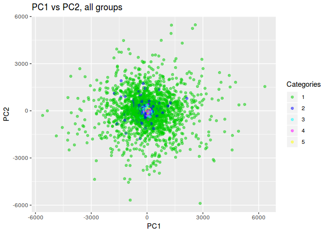
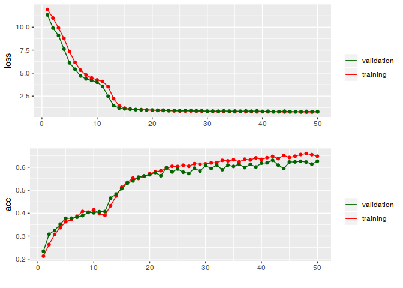
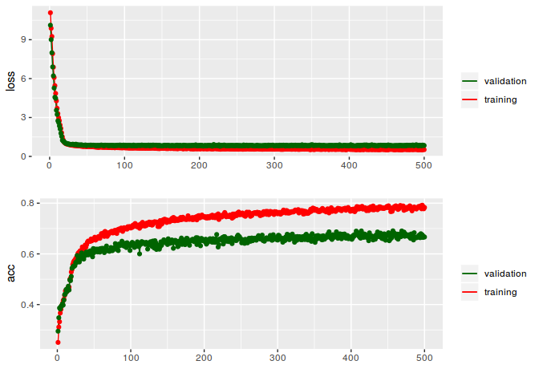
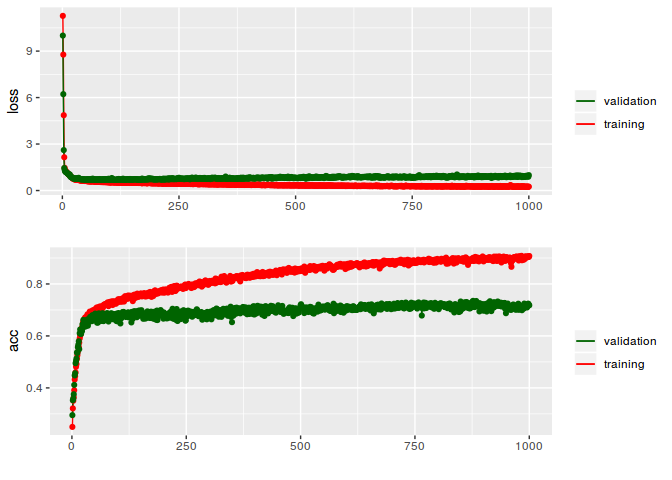
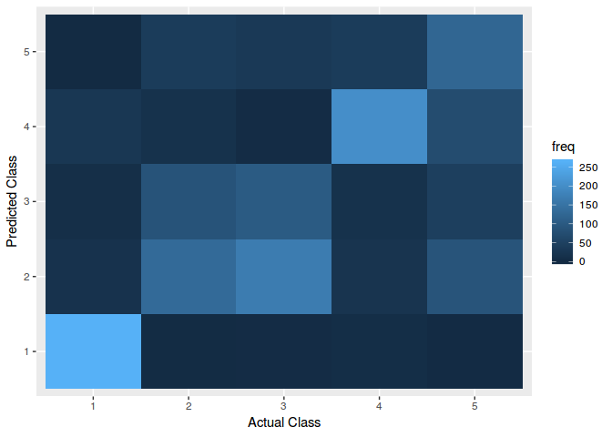

``` r
library(dplyr)
library(tidyr)
library(ggplot2)
library(keras)
library(tfruns)
library(tensorflow)
library(gridExtra)
```

``` r
set.seed(104)
use_session_with_seed(104, disable_gpu = FALSE, disable_parallel_cpu = FALSE)
```

    ## Set session seed to 104

### Loading data

Data loaded and split into explanatoy variables (everything but the first and last column in the dataset) and the resulting classification (last column). More information about the dataset can be found at [The UCI Machine Learning Repository](https://archive.ics.uci.edu/ml/datasets/Epileptic+Seizure+Recognition).

``` r
# Load data
data <- read.table('epil-seizure.csv', header = T, stringsAsFactors = F, sep=',')

# Split data into to explanatory (exp) and response (res)
exp <- data.matrix(data[,2:179])
res <- data[,180]
```

### Principal Component Analysis

To get an overview of the data it makes sense to investiagte how well the various groups are separated to begin with using a dimensionality reduction algorithm such as principal component analysis (PCA). In the PCA plot we see that the first group (group 1 - seizure) shows the most variation in the first two principal components, with the latter groups grouping towards the center (. The plot shows that the various groups are interspersed and it is not straight forward to distinguish the groups. It makes sense to try out a deep learning approach in an attempt to distinguish the groups based on the available data.

``` r
# Perform PCA and plot the output
pc <- prcomp(data[,2:179])

t <- as.data.frame(pc$x)
t2 <- cbind(t,res)

ggplot(t) + 
  geom_point(aes(PC1,PC2, col=as.factor(res)), alpha = 0.5) + 
  scale_color_manual(values = palette()[3:7]) + 
  ggtitle("PC1 vs PC2, all groups") +
  guides(colour=guide_legend(title="Categories"))
```



Developing the deep learning algorithm
--------------------------------------

### Splitting the data

The dataset is split into a training and testing set. The training set contains 10.000 observations and testing set 1.500.

``` r
# Split dataset into test and training
epi_x_train <- exp[1:10000,]
epi_y_train.cat <- res[1:10000]
epi_y_train <- to_categorical(epi_y_train.cat)[,2:6]

epi_x_test <- exp[10001:nrow(exp),]
epi_y_test.cat <- res[10001:nrow(exp)]
epi_y_test <- to_categorical(epi_y_test.cat)[,2:6]
```

### Model selection

I decided to start of using a fully connected multi-layer perceptron which seems most widely used when dealing with classification tasks with multiple output categories. Previous experience suggests using relu (REctified Linear Unit) activation function in the hidden layers. The relu activator is quicker when tuning due to less active neurons by its design (because negative values are set to 0). Even though various activators could be part of hyperparameter optimization (see later), I have chosen to keep the activator static due to time constraints and because relu seems to be the most widely used (I did some behind the scenes tweaking to see if other activators worked better without much luck). The loss function used is cateogorical crossentropy which is the natural choice when dealing with multi-class classification. The optimizer used for this excercise is adam (Adaptive Moment Estimation). This was chosen because it is generally fast to converge and is more robust to vanishing learning rate. The dropout layer is added to avoid over-fitting. Dropping out a random set of neurons will break any co-dependency between neurons. Validation split is set at 0.2, meaning that 20% of the data in the training set is used for validation and the remaining 80% is used for actually training the model. The metric we want to evaluate the model on is accuracy, i.e. how accurate the model classifies observations in the test data.

As the output layer concists of five neurons (five output categories) it makes sense to use the softmax activator in the final layer. Softmax will output values in the range from 0 to 1 and can be used as a probability distribution for the five different classes we are trying to predict.

First, let's look at the performance of the initial network with arbitrarily chosen input values. The network consists of four layers (input, dropout, hidden, output). The number of inputs to the first layer is the number of explanatory variables. The model can be depicted in the code below. The model is trained using 200 epochs.

``` r
tensorflow:::use_session_with_seed(1,disable_gpu=FALSE,disable_parallel_cpu=FALSE)
# generate model
model1 = keras_model_sequential() 
model1 %>%
  layer_dense(units = 50, activation = 'relu', input_shape = c(ncol(exp))) %>% 
  layer_dropout(rate = 0.2) %>% 
  layer_dense(units = 100, activation = 'relu') %>%
  #layer_dense(units = 150, activation = 'relu') %>%
  layer_dense(units = 5, activation = 'softmax')

# View a smmary of the model
summary(model1)

model1 %>% compile(
  loss = 'categorical_crossentropy',
  optimizer = 'adam',
  metrics = c('accuracy')
)

# fit the model
history1 <- model1 %>% fit(
  epi_x_train, epi_y_train, 
  epochs = 50, 
  validation_split = 0.2,
  verbose = 1
)

save(history1, file = 'history1.Rdata')
```

### First evaluation after 50 epochs

After the first attempt of creating a neural network as specified running for 50 epochs we see that the loss declines, and accuracy increases, rapidly up until approximately the 15-20th epoch before they level off. We see that we don't gain much in validation accuracy after ~40th epoch. However, the validation accuracy does not drop, ie. no sign of over-fitting.

``` r
load(file = 'history1.Rdata')
plot_history(data.frame(history1$metrics))
```



### Second evalution after 500 epochs

Running the same model for 500 epochs we confirm we do not really gain much. We do see a slight increase in validation accuracy when we let the model train longer, but not by much.

``` r
# generate model
model2 = keras_model_sequential() 
model2 %>%
  layer_dense(units = 50, activation = 'relu', input_shape = c(ncol(exp))) %>% 
  layer_dropout(rate = 0.2) %>% 
  layer_dense(units = 100, activation = 'relu') %>%
  #layer_dense(units = 150, activation = 'relu') %>%
  layer_dense(units = 5, activation = 'softmax')

# View a smmary of the model
summary(model2)

model2 %>% compile(
  loss = 'categorical_crossentropy',
  optimizer = 'adam',
  metrics = c('accuracy')
)

# fit the model
history2 <- model2 %>% fit(
  epi_x_train, epi_y_train, 
  epochs = 500, 
  validation_split = 0.2,
  verbose = 1
)

save(history2, file = 'history2.Rdata')
```

``` r
load(file = 'history2.Rdata')
plot_history(data.frame(history2$metrics))
```



Hyperparameter optimization
---------------------------

In order to inspect performance when using different input values to the network, hyperparameter optimization was performed. Both the number of neurons in the hidden layers and different dropout rates were investigated. Additionally, testing the performance of the network when adding an additional hidden layer was looked into.

### Optimizing initial model

Using hyperparameter optimization all models with combinations of 50, 100 or 150 units in the two hidden layers and a dropout rate of 0, 0.2 and 0.4 in the dropout layer was tested for all combinations. The results show that a model using 50 units in both layers and a dropout of 0 receives the best validation accuracy after 20 epochs. The validtion accuracy is 0.60.

NOTE: the hyperparameter optimization has to be dispatched to a different script to run properly. The code for the repo can be found on github: []()

``` r
# Testing archictecture with two layers
runs_2l <- tuning_run("epi_mlp_2layer.R", flags = list(
  l1units = c(50, 100, 150),
  l2units = c(50, 100, 150),
  dropout1 = c(0,0.2,0.4)
))

save(runs_2l, file = 'runs_2l.Rdata')
```

``` r
load(file = 'runs_2l.Rdata')

rundf_2l <- runs_2l[,c('eval_loss','eval_acc', 'metric_loss', 'metric_val_loss', 'metric_val_acc', 'flag_l1units', 'flag_l2units', 'flag_dropout1', 'epochs')]
knitr::kable(head(arrange(rundf_2l, desc(metric_val_acc))))
```

|  eval\_loss|  eval\_acc|  metric\_loss|  metric\_val\_loss|  metric\_val\_acc|  flag\_l1units|  flag\_l2units|  flag\_dropout1|  epochs|
|-----------:|----------:|-------------:|------------------:|-----------------:|--------------:|--------------:|---------------:|-------:|
|      1.0759|     0.6027|        0.6952|             1.0576|            0.6015|             50|             50|               0|      20|
|      0.8846|     0.5813|        0.7343|             0.9311|            0.5755|            150|             50|               0|      20|
|      1.2015|     0.5840|        0.6454|             1.3159|            0.5745|             50|            150|               0|      20|
|      1.3365|     0.5753|        0.6557|             1.2683|            0.5730|            100|            150|               0|      20|
|      1.3640|     0.5713|        0.7215|             1.3385|            0.5605|             50|            100|               0|      20|
|      1.1316|     0.5460|        0.8705|             1.2650|            0.5545|            100|            100|               0|      20|

### Optimizing with additional hidden layer

In order to investiagte what an additinal hidden layer would do to the performance of the network a layer was added and the hyperparameter optimization was performed again. The results show that adding the additional layer improved the validation accuracy with 100,150 and 150 units in the three layers, respectively, and a dropout of 0.2 in the dropout layer. Accuracy improved to 0.66.

``` r
# Testing architecture with 3 layers
runs_3l <- tuning_run("epi_mlp_3layer.R", flags = list(
  l1units = c(50, 100, 150),
  l2units = c(50, 100, 150),
  l3units = c(50, 100, 150),
  dropout1 = c(0,0.2,0.4)
))

save(runs_3l, file = 'runs_3l.Rdata')
```

``` r
load(file = 'runs_3l.Rdata')

rundf_3l <- runs_3l[,c('eval_loss','eval_acc', 'metric_loss', 'metric_val_loss', 'metric_val_acc', 'flag_l1units', 'flag_l2units', 'flag_l3units', 'flag_dropout1','epochs')]
knitr::kable(head(arrange(rundf_3l, desc(metric_val_acc))))
```

|  eval\_loss|  eval\_acc|  metric\_loss|  metric\_val\_loss|  metric\_val\_acc|  flag\_l1units|  flag\_l2units|  flag\_l3units|  flag\_dropout1|  epochs|
|-----------:|----------:|-------------:|------------------:|-----------------:|--------------:|--------------:|--------------:|---------------:|-------:|
|      0.7692|     0.6533|        0.7668|             0.7806|            0.6565|            150|             50|             50|             0.2|      20|
|      0.7823|     0.6613|        0.8109|             0.7987|            0.6505|            100|             50|            150|             0.2|      20|
|      0.7730|     0.6613|        0.7593|             0.8144|            0.6420|            100|            150|            150|             0.2|      20|
|      0.7846|     0.6527|        0.7826|             0.8499|            0.6410|            100|            100|            100|             0.2|      20|
|      0.8018|     0.6460|        0.7720|             0.8121|            0.6365|            150|            100|            150|             0.2|      20|
|      0.9555|     0.6313|        0.5492|             0.9809|            0.6350|            150|            150|            100|             0.0|      20|

### Optimizing with incrased number of neurons

Since an significant improvement was seen after adding an additional layer, it made sense to investiagte the potential performance increase when increasing the number of neurons in the hidden layers in the higher range. An hyperparameter optimization similar to the previous but testing with combinations of higher number of units were performed. Results show the best performing model has a decreased validation accuracy (0.64) and is also the model with the lowest number of units possible for all hidden layers. This suggests that increasing the number of units is not beneficial for our model.

``` r
# Testing architecture with 3 layers and high number of nodes
runs_3l_high <- tuning_run("epi_mlp_3layer.R", flags = list(
  l1units = c(150, 200, 400),
  l2units = c(150, 200, 400),
  l3units = c(150, 200, 400),
  dropout1 = c(0,0.2,0.4)
))

save(runs_3l_high, file = 'runs_3l_high.Rdata')
```

``` r
load(file = 'runs_3l_high.Rdata')

rundf_3l_high <- runs_3l_high[,c('eval_loss','eval_acc', 'metric_loss', 'metric_val_loss', 'metric_val_acc', 'flag_l1units', 'flag_l2units', 'flag_l3units', 'flag_dropout1', 'epochs')]
knitr::kable(head(arrange(rundf_3l_high, desc(metric_val_acc))))
```

|  eval\_loss|  eval\_acc|  metric\_loss|  metric\_val\_loss|  metric\_val\_acc|  flag\_l1units|  flag\_l2units|  flag\_l3units|  flag\_dropout1|  epochs|
|-----------:|----------:|-------------:|------------------:|-----------------:|--------------:|--------------:|--------------:|---------------:|-------:|
|      0.7854|     0.6540|        0.7367|             0.8391|            0.6375|            150|            150|            150|             0.2|      20|
|      0.8355|     0.6373|        0.8495|             0.8602|            0.6275|            150|            150|            150|             0.4|      20|
|      0.9560|     0.6433|        0.5332|             1.0176|            0.6175|            200|            150|            200|             0.0|      20|
|      0.8492|     0.6400|        0.6247|             0.9511|            0.6135|            150|            150|            150|             0.0|      20|
|      1.0629|     0.6260|        0.5096|             1.1628|            0.6115|            150|            200|            150|             0.0|      20|
|      1.1404|     0.6107|        0.5546|             1.1575|            0.6100|            200|            150|            150|             0.0|      20|

We will continue with the model above, displaying the best performance whe using 150, 50 and 50 neurons in the three hidden layers respectively and dropout of 0.2.

Training the proposed best model
--------------------------------

With some more insight into the best performing parameters, the suggested number of units and dropout rate is used to train a model for 500 epochs. From the plot we can see that the loss and validation accuracy improves drastically up until approx the 20th epoch before it continues to improve marginally. Of importance here is that the validation loss does not increase during the 1000 epochs, and the validation accuracy steadily increases/improves. This suggest that the model is not overfitting and even though the accuracy of the training set and validation set depart early on, the model gradually improves to the best validation accuracy at 0.729.

``` r
# generate model
model3 = keras_model_sequential() 
model3 %>%
  layer_dense(units = 150, activation = 'relu', input_shape = c(ncol(exp))) %>% 
  layer_dropout(rate = 0.2) %>% 
  layer_dense(units = 50, activation = 'relu') %>%
  layer_dense(units = 50, activation = 'relu') %>%
  layer_dense(units = 5, activation = 'softmax')

# View a smmary of the model
summary(model3)

model3 %>% compile(
  loss = 'categorical_crossentropy',
  optimizer = 'adam',
  metrics = c('accuracy')
)

# fit the model
history3 <- model3 %>% fit(
  epi_x_train, epi_y_train, 
  epochs = 1000, 
  validation_split = 0.2,
  verbose = 1
)

save(history3, file = 'history3.Rdata')
save(model3, file = 'model3.Rdata')
```

``` r
load(file = 'history3.Rdata')
plot_history(data.frame(history3$metrics))
```



Assess model performance on test data
-------------------------------------

After training the model we need to assess how the model performs on the test data (the subset of the data that the model has not seen before). We find that the accuracy in predicting the classes in this dataset is 0.714.

``` r
load(file = 'model3.Rdata')
score <- model3 %>% evaluate(epi_x_test, epi_y_test)
s <- score$acc

save(s, file = 's.Rdata')
```

``` r
load(file = 's.Rdata')
print(s)
```

    ## [1] 0.7146667

This might be better visualized in a confusion matrix and accompanying plot where we can see that the model does a decent job (depending on who you ask...) of classifying the test dataset. The plot and matrix also gives an impression of where the model fails. The model does a good job of classifying category 1 (seizure) with fewer misclassifications compared to the lower categories where the model struggles to distinguish the different categories. This is reasonable from what was found in the initial principal component analysis.

``` r
classes <- model3 %>% predict_classes(epi_x_test)
save(classes, file = 'classes.Rdata')
```

``` r
load(file = 'classes.Rdata')

# generate confusion matrix
cm <- table(epi_y_test.cat, classes+1)
print(cm)
```

    ##               
    ## epi_y_test.cat   1   2   3   4   5
    ##              1 264  16   8  27   0
    ##              2   2 132  86  15  37
    ##              3   3 167 101   3  32
    ##              4   6  20  15 201  37
    ##              5   1  88  44  71 124

``` r
cm.df <- as.data.frame(cm)
names(cm.df) <- c('actual','predict','freq')

plot <- ggplot(cm.df)
plot + geom_tile(aes(x=actual, y=predict, fill=freq)) +
  scale_x_discrete(name="Actual Class") +
  scale_y_discrete(name="Predicted Class") 
```



Conclusion
----------

First of all, there is ample room for improving this model. Due to spending half a week getting the GPU acceleration to work properly in Linux and R, some shortcuts were necessary. The GPU acceleration was necessary to make hyperparameter optimization achievable (the speedup increase was approx ~20x on my system). To improve the model, various optimizers and activators could be tested in hyperparameter optimization in additional to more finegrained testing of units in layers and possible a completely different architecture. To my understanding there is no benefit of trying out other loss functions than categorical crossentropy when training a multi-class classification (but I might be wrong about this...). Also, the number of epochs used in the hyperparameter optimization is relatively low. Increasing the number of epochs could potentially reveal better models if they needed to train for longer. Additional parameters naturally increase the search scope when doing hyperparameter optimization. However, more intelligent optimization algorithms can inspect the search space more selectively and prevent testing combinations that is likely to yield poor performance.
